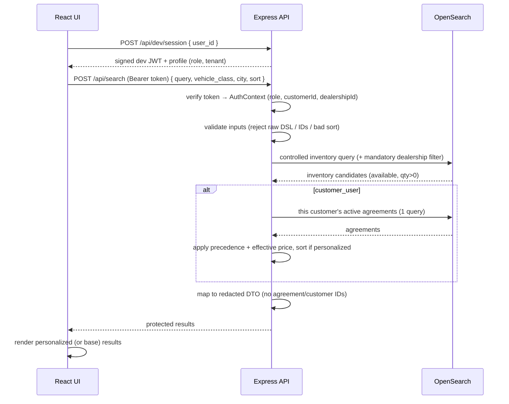

# B2B Car-Rental Search POC

A local proof of concept for centralized B2B car-rental inventory search with
customer-specific pricing, in two phases:

- **Phase 1 — OpenSearch environment** (this section below): a clean single-node
  cluster, explicit index mappings, idempotent ingestion, verification queries.
- **Phase 2 — Protected personalized search** ([jump ↓](#phase-2--protected-personalized-search)):
  an Express API + React UI implementing mock authentication, role/tenant
  authorization, controlled queries, and personalized pricing.

> 🔑 **The point of this project** is the multi-tenant access-control architecture:
> how an application layer separates **authorization** from **retrieval** so that
> OpenSearch stays a search engine and the app owns identity, tenant scoping, and
> redaction. That design is written up in
> **[docs/ACCESS_CONTROL.md](docs/ACCESS_CONTROL.md)** — start there.

> **Local development only.** The stack runs the OpenSearch security plugin with
> the bundled self-signed demo certificate and a single admin user from `.env`.
> Authentication in Phase 2 is **mocked**. Nothing here is hardened; never expose
> it to a network or use it in production.

---

# Phase 1: OpenSearch Environment

A small, local OpenSearch environment. This phase establishes a clean, working
cluster, explicit index mappings, a repeatable/idempotent ingestion process, and
verification queries. It does **not** contain the application, pricing, or authz —
those are [Phase 2](#phase-2--protected-personalized-search).

---

## Architecture

```
                 docker compose (local dev only)
   ┌─────────────────────────────┐     ┌──────────────────────────────┐
   │ opensearch (single-node)    │◀────│ opensearch-dashboards :5601  │
   │  security plugin ON (HTTPS) │     └──────────────────────────────┘
   │  :9200 REST   :9600 perf    │
   │  volume: opensearch-data    │
   └─────────────────────────────┘
              ▲  REST over HTTPS (verify_certs=false, admin creds from .env)
              │
   ┌──────────┴───────────────────────────────────────────┐
   │ Python: opensearch-py + python-dotenv                 │
   │ wait_for_opensearch → create_indexes → ingest_data    │
   │ verify_environment ;  reset_indexes (teardown)        │
   └───────────────────────────────────────────────────────┘
```

## Project structure

```
.
├── docker-compose.yml          # single-node OpenSearch + Dashboards
├── .env.example                # copy to .env and edit
├── requirements.txt            # opensearch-py, python-dotenv
├── data/                       # synthetic source JSON (source of truth)
├── opensearch/
│   ├── mappings/               # one explicit mapping per index
│   └── queries/                # 10 sample query documents
└── scripts/
    ├── common.py               # shared config + client factory
    ├── wait_for_opensearch.py
    ├── create_indexes.py
    ├── ingest_data.py
    ├── reset_indexes.py
    └── verify_environment.py
```

## Indexes

| Index                 | Stable `_id`       | Notes                                                        |
| --------------------- | ------------------ | ----------------------------------------------------------- |
| `dealerships`         | `dealership_id`    | `location` as `geo_point`                                   |
| `vehicle_models`      | `vehicle_model_id` | class/fuel/transmission as keyword, `description` as text   |
| `inventory`           | `inventory_id`     | **denormalized** dealership + vehicle-model fields          |
| `customers`           | `customer_id`      | company name text + keyword                                 |
| `customer_agreements` | `agreement_id`     | denormalized readable customer + dealership names           |

Mappings are **explicit** (`"dynamic": "strict"`) — see `opensearch/mappings/`.
`inventory` documents are denormalized so search needs no joins:
`dealership_name`, `dealership_city`, `dealership_location`, `make`, `model`,
`vehicle_class`, `description`, `seats`, `fuel_type`, `base_daily_rate`,
`quantity_available`, `status`, `last_updated`, and more.

---

## Prerequisites

- **Docker** + Docker Compose v2 (`docker compose`), with ~2 GB free for the
  OpenSearch container.
- **Python 3.9+** on the host to run the setup/ingestion scripts.

On Linux you may need to raise the map-count limit OpenSearch requires:

```bash
sudo sysctl -w vm.max_map_count=262144
```

## 1. Configure `.env`

```bash
cp .env.example .env
```

Edit `.env` and set a strong `OPENSEARCH_INITIAL_ADMIN_PASSWORD` (and keep
`OPENSEARCH_PASSWORD` in sync with it). The password policy requires at least 8
characters with upper, lower, digit, and symbol. `.env` is git-ignored.

Install the Python dependencies (a virtualenv is recommended):

```bash
python3 -m venv .venv && source .venv/bin/activate
pip install -r requirements.txt
```

## 2. Start the environment

```bash
docker compose up -d
```

Wait until OpenSearch is healthy:

```bash
python scripts/wait_for_opensearch.py
```

## 3. Create indexes

```bash
python scripts/create_indexes.py          # idempotent; skips existing indexes
# python scripts/create_indexes.py --force  # delete + recreate (destroys data)
```

## 4. Ingest data

```bash
python scripts/ingest_data.py
```

Ingestion is **repeatable and idempotent**: each document uses its natural id as
the OpenSearch `_id`, so rerunning updates documents in place — it never creates
duplicates. Safe to run as many times as you like.

## 5. Run verification

```bash
python scripts/verify_environment.py
```

Confirms every index's document count matches the source data and runs a few
sample queries (available SUVs, geo-distance around Chicago, BM25 description
search, active agreements, aggregation by vehicle class). Exits non-zero on any
count mismatch.

## 6. Open OpenSearch Dashboards

Browse to **http://localhost:5601** and log in with the admin username/password
from `.env`. Use **Dev Tools → Console** to paste any request body from
`opensearch/queries/`, for example:

```
GET inventory/_search
{ ...paste the query body... }
```

## 7. Reset everything

Delete just the indexes (keep the container and volume):

```bash
python scripts/reset_indexes.py --yes
```

Tear the whole stack down, including the data volume:

```bash
docker compose down -v
```

---

## Sample queries

Pure request bodies live in `opensearch/queries/` (see
[`opensearch/queries/README.md`](opensearch/queries/README.md) for the index
each one targets). Run them in Dashboards Dev Tools or via curl, e.g.:

```bash
curl -sk -u "admin:$OPENSEARCH_PASSWORD" \
  "https://localhost:9200/inventory/_search" \
  -H 'Content-Type: application/json' \
  -d @opensearch/queries/01_list_available_suvs.json
```

| # | File | What it demonstrates | Index |
|---|------|----------------------|-------|
| 1 | `01_list_available_suvs.json` | List available SUVs | `inventory` |
| 2 | `02_filter_by_dealership_city.json` | Filter by dealership city | `inventory` |
| 3 | `03_geo_distance_chicago.json` | Vehicles within geo-distance of Chicago | `inventory` |
| 4 | `04_sort_by_base_daily_rate.json` | Sort by base daily rate | `inventory` |
| 5 | `05_search_descriptions_bm25.json` | BM25 description search | `inventory` |
| 6 | `06_active_agreements_for_customer.json` | Active agreements for one customer | `customer_agreements` |
| 7 | `07_agreements_for_dealership.json` | Agreements for one dealership | `customer_agreements` |
| 8 | `08_agg_available_by_vehicle_class.json` | Aggregate available inventory by class | `inventory` |
| 9 | `09_agg_inventory_by_dealership.json` | Aggregate inventory by dealership | `inventory` |
| 10 | `10_verify_counts.md` | Verify document counts vs source | all |

## Expected index and document counts

| Index                 | Documents |
| --------------------- | --------- |
| `dealerships`         | 5         |
| `vehicle_models`      | 5         |
| `inventory`           | 50        |
| `customers`           | 12        |
| `customer_agreements` | 36        |

`users.json` (19 records) is intentionally **not** indexed.

---

## Security notes

- The OpenSearch **security plugin stays enabled**. Development credentials come
  from `.env`; no secrets are committed (`.env` is git-ignored).
- **No passwords or password hashes are indexed.** `users.json` is not ingested,
  so no user emails or credentials enter any index.
- TLS uses the bundled **self-signed demo certificate**; the Python clients set
  `verify_certs=false` and Dashboards uses `SSL_VERIFICATIONMODE=none`. This is
  acceptable only for local development.
- **Application-level authentication and role-based authorization are not
  implemented in this phase.** The dataset models three future roles (customer,
  dealership, corporate), but access is currently unrestricted for a single
  admin user.

## Known limitations

- Single-node cluster with `number_of_replicas: 0` (so cluster status is
  `green`) — no high availability and not tuned for scale.
- Self-signed cert with verification disabled (local dev only).
- Denormalized fields in `inventory` / `customer_agreements` are a point-in-time
  copy taken at ingest; changing a source dealership/vehicle/customer record
  requires re-running ingestion to propagate.
- No application layer, no authorization, no personalized pricing yet.

Phase 1's application layer, authorization, and personalized pricing are
delivered in [Phase 2](#phase-2--protected-personalized-search) below.

---

# Phase 2: Protected Personalized Search

An **Express (TypeScript) API** and a **minimal React (Vite) UI** implementing one
complete protected search flow on top of the Phase 1 cluster: pick a synthetic
identity → mock signed session → business-level search → server-side authorization
→ controlled OpenSearch query → customer-specific pricing → redacted response → UI.

> **Development only.** Authentication is **mocked** over the synthetic
> `data/users.json`. There are no real passwords, registration, recovery,
> payments, or booking. Application-level authorization is the primary control.

## Architecture

```
frontend/ (React + Vite)          backend/ (Express + TypeScript)
──────────────────────            ────────────────────────────────────────────
UserSwitcher / SearchControls     routes/         → thin HTTP handlers
        │  fetch (Bearer token)   auth/           → dev JWT sign/verify + requireAuth
        ▼                         validation/     → zod: safe domain inputs only
  /api/dev/session ───────────►   services/searchService     → controlled OS query
  /api/meta                       services/agreementService  → 1 agreements query
  /api/search ────────────────►   services/pricingService    → precedence + rounding
                                  services/protectedSearch   → orchestration + sort
                                  dto/mapResults  → role-specific redaction
                                        │
                                        ▼  @opensearch-project/opensearch (creds server-side)
                                  Phase 1 OpenSearch (inventory + customer_agreements)
```

The **frontend never queries OpenSearch** and never sees its credentials. All
identity, authorization, agreement resolution, pricing, response shaping, and
application-side personalized-price sorting happen in the Express service.

### Protected search sequence



## Roles vs. tenants

**Tenants** are data-isolation boundaries; **roles** are what a user may do.

| Role | Tenant type | Inventory scope | Pricing |
| --- | --- | --- | --- |
| `customer_user` | a **customer** organization | all dealerships | personalized from *its own* active agreements |
| `dealership_user` | a **dealership** | **only its own** dealership (mandatory server filter) | base price only |
| `corporate_admin` | privileged **cross-tenant** | all dealerships | base price only (Phase 2) |

A `customer_user` cannot choose/override its `customer_id`, cannot read raw
agreements, and cannot see another customer's pricing. A `dealership_user` cannot
remove its dealership filter or see another dealership's commercial data.

## How mock authentication works

`POST /api/dev/session { "user_id": "USR-001-C" }` verifies the user exists and is
`active`, then signs a short-lived JWT (`JWT_DEV_SECRET`, default 1h) carrying the
role and tenant IDs. Every protected request must send `Authorization: Bearer
<token>`; the server derives identity **only** from the verified token — role,
customer, and dealership supplied in query/body are ignored/rejected. Inactive
users are refused (403). No passwords exist or are checked.

## Protected search flow & agreement precedence

1. Retrieve matching inventory from OpenSearch (filter context: `vehicle_class`,
   `dealership_city`, `status`, `quantity_available > 0`; `multi_match` text over
   make/model/vehicle_class/description; BM25 scoring). Dealership users get a
   mandatory `dealership_id` filter.
2. For a `customer_user`, retrieve that customer's **active, date-valid**
   agreements in **one** query and build an in-memory lookup.
3. Apply the discount by **precedence**:
   1. dealership **and** exact `vehicle_class` agreement;
   2. else dealership-wide agreement (`vehicle_class = null`);
   3. else no discount (base rate).
4. `effective_daily_rate = round2(base_daily_rate × (1 − discount_percent / 100))`.
5. When `sort = personalized_price_asc`, rerank **in the service** after pricing.
6. Return redacted DTOs.

Eligibility: `agreement_status = active` **and** `valid_from ≤ today ≤ valid_to`.

## Run it

Prerequisites: Phase 1 cluster **up and populated** (`docker compose up -d`, then
create + ingest), plus Node ≥ 20.

```bash
# Backend (terminal 1)
cd backend
npm install
npm run dev            # http://localhost:4000

# Frontend (terminal 2)
cd frontend
npm install
npm run dev            # http://localhost:5173
```

Open http://localhost:5173, pick a user, and search.

### UI modes: Basic & Procurement

A segmented toggle at the top of the search interface switches between two modes:

- **Basic Search** — the implemented, backend-connected flow described above
  (protected personalized search over live OpenSearch inventory).
- **Procurement Search** — a **front-end-only mockup** (clearly labeled *"Future
  procurement workflow — mock data"*) illustrating how a large customer would
  source many vehicles across regions. It calls **no backend** and runs no
  optimizer; it renders a static, deterministic sample sourcing plan (allocation
  table + summary) to show how the problem shifts from *ranking results* to
  *allocating demand across locations*. Concept flow:


The first two stages reuse today's implemented pipeline; only the allocation /
optimization stage is future/unbuilt.

### Environment variables (root `.env`, added in Phase 2)

| Var | Default | Purpose |
| --- | --- | --- |
| `API_PORT` | `4000` | Express API port |
| `JWT_DEV_SECRET` | `dev-only-…` | signing secret for dev session tokens (**change it**) |
| `JWT_TTL_SECONDS` | `3600` | session token lifetime |
| `CORS_ORIGIN` | `http://localhost:5173` | browser origin allowed by CORS |
| `VITE_API_BASE_URL` | `http://localhost:4000` | API base URL used by the frontend |

The backend reuses the Phase 1 `OPENSEARCH_*` values from the same `.env`
(currently `OPENSEARCH_PORT=9201` locally). OpenSearch credentials stay
server-side and are never exposed to the browser.

## Example users to select

| user_id | Role | Tenant |
| --- | --- | --- |
| `USR-001-C` | customer_user | Prairie Electric Services (CUS-001) — has a 28% Chicago-wide deal |
| `USR-002-C` | customer_user | Northline HVAC Group (CUS-002) — different agreements |
| `USR-JOL-D` | dealership_user | Joliet Jobsite Vehicles (DLR-JOL) |
| `USR-CORP-001` | corporate_admin | cross-tenant |
| `USR-012-C` | *inactive* — session is refused (403) |

## Example searches

- Vehicle class **suv**, sort **personalized price** as `USR-001-C`: Chicago SUV
  ($92 base) prices to **$66.24** and outranks Joliet ($84 base) — the intended
  price inversion.
- Same search as `USR-002-C`: different prices/order (no Chicago-wide deal).
- Any search as `USR-JOL-D`: only Joliet inventory, base prices.
- City **Chicago**, any class: filters inventory to Chicago dealership.

## Run the tests

```bash
cd backend
npm test
```

24 tests (Vitest + supertest) cover all required cases: unauthenticated rejection,
inactive-user session refusal, identity-override rejection, differing prices
across customers, base-rate fallback, class-specific precedence, expired/inactive
agreements ignored, response redaction, dealership scoping and non-override,
corporate cross-dealership, personalized-sort-after-pricing, and input validation.
Three live-integration tests exercise the real cluster and **skip automatically**
if OpenSearch is unreachable.

## API summary

| Method / path | Auth | Purpose |
| --- | --- | --- |
| `POST /api/dev/session` | none (dev) | mint a token for an active synthetic user |
| `GET /api/dev/users` | none (dev) | active users for the switcher (labels only) |
| `GET /api/meta` | Bearer | vehicle classes + cities for dropdowns |
| `POST /api/search` | Bearer | protected personalized/base search |

`POST /api/search` accepts only `{ query?, vehicle_class?, city?, sort? }` where
`sort ∈ {relevance, base_price_asc, personalized_price_asc}`. Any other key
(raw DSL, index name, `_source`, `customer_id`, `dealership_id`, arbitrary sort)
is rejected with 400.

## Security boundaries (Phase 2)

> Full rationale, the four authorization checkpoints, the trust boundary, and a
> threat-model table are in **[docs/ACCESS_CONTROL.md](docs/ACCESS_CONTROL.md)**.

- Unauthenticated protected requests are rejected (401); inactive users refused (403).
- Tenant identity is derived **only** from the verified token; client-supplied
  role/customer/dealership is never trusted.
- The dealership filter is injected server-side and cannot be removed or overridden.
- Responses expose only approved DTO fields — never raw agreements, agreement IDs,
  customer IDs, unrestricted `_source`, OpenSearch metadata, or secrets.
- OpenSearch credentials and the JWT secret live in env vars, server-side only.
- CORS is limited to the local Vite origin; request bodies are size-limited and
  validated; errors are returned without stack traces or upstream internals.

## Known limitations & why personalized sorting is in the service layer

- **App-side personalized sort:** OpenSearch cannot globally sort by a dynamically
  calculated customer-specific price unless that price is indexed or computed via a
  different architecture. So Phase 2 fetches a bounded candidate set (200; dataset
  is 50) and reranks by `effective_daily_rate` **in the service** after pricing.
  A future phase may evaluate **materialized customer-specific offers**.
- Mock auth only — no real identity management, registration, recovery, MFA.
- **Application-level authorization is the primary Phase 2 control.** OpenSearch
  document-/field-level security (DLS/FLS) is **not** implemented; it is a
  potential future **defense-in-depth** layer, not a substitute.
- Corporate admins receive base prices only in Phase 2 (no cross-customer pricing).
- Dependency `npm audit` reports advisories in dev/tooling transitive packages;
  acceptable for a local POC, not for production.

## Next-phase options

- Real authentication/identity provider integration and refresh/rotation.
- OpenSearch DLS/FLS as defense-in-depth beneath the application authorization.
- Materialized or precomputed personalized offers to enable index-level price sort.
- Availability/booking, richer relevance tuning, and dealership analytics.
