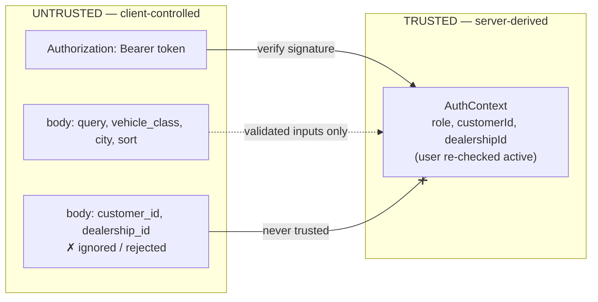
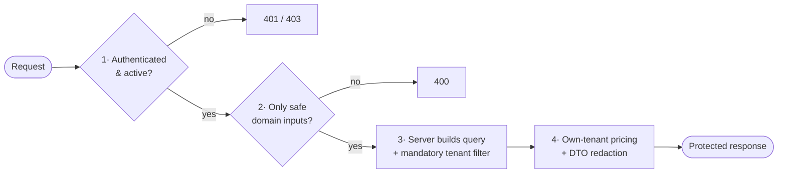

# Multi-Tenant Access Control — Design Note

This document is the conceptual heart of the POC. It explains **how the
application layer separates *authorization* from *retrieval*** in a multi-tenant
B2B system, and why that separation is the right architecture.

> **Thesis:** OpenSearch is a **retrieval engine, not an authorization boundary.**
> In a multi-tenant application, identity, tenant scoping, and data redaction must
> be owned by the application layer — *around* retrieval, never delegated to the
> search engine or to the client. This project is a small, complete demonstration
> of that principle.

---

## 1. The tenancy model

Two things are easy to conflate but must be kept distinct: **who you are** (role)
and **which slice of data you belong to** (tenant).

| Concept | In this system |
| --- | --- |
| **Tenant** — an isolation boundary for data | a **customer** organization (`CUS-*`) or a **dealership** (`DLR-*`) |
| **Role** — what a user is allowed to do | `customer_user`, `dealership_user`, `corporate_admin` |
| **Cross-tenant principal** | `corporate_admin` — deliberately spans all tenants |

A single inventory corpus is shared by every tenant, but **what each tenant may
see and at what price differs**:

| Role | Tenant | Retrieval scope | Pricing scope |
| --- | --- | --- | --- |
| `customer_user` | one customer org | all dealerships' inventory | **only its own** negotiated agreements |
| `dealership_user` | one dealership | **only its own** dealership's inventory | base price only |
| `corporate_admin` | none (privileged) | all dealerships' inventory | base price only (Phase 2) |

The key multi-tenant challenges this raises:
- **Horizontal isolation** — a dealership user must never see another dealership's
  inventory; a customer must never see another customer's pricing.
- **Data-dependent authorization** — a customer's *price* depends on *its own*
  private agreements, which are commercial data other tenants must not read.
- **A shared backing store** — all of this sits in one OpenSearch cluster with one
  set of credentials.

---

## 2. Why authorization does **not** live in OpenSearch

OpenSearch is excellent at what a search engine should do: **retrieve, filter,
score (BM25), and aggregate**. It is intentionally used for exactly that here and
nothing more. Authorization is kept in the application layer for concrete reasons:

1. **The query is only as trustworthy as who built it.** If the browser could send
   Query DSL, "authorization" would mean trusting the client to filter its own
   results — which is no authorization at all. The **frontend never talks to
   OpenSearch** and never holds its credentials; the server constructs every query
   from a *verified* identity. (See [§4](#4-the-four-authorization-checkpoints).)
2. **Business rules aren't index security.** Agreement **precedence** (class-specific
   beats dealership-wide) and the **effective-price formula** are domain logic, not
   something document-/field-level security can express.
3. **One place to reason about and audit.** Concentrating authorization in a few
   named modules makes the rules reviewable and testable, instead of scattering
   them across index templates, roles, and query-time security.
4. **Single shared credential today.** The Phase 1 cluster uses one admin user.
   Per-tenant OpenSearch identities/DLS could be added later as *defense in depth*
   ([§7](#7-defense-in-depth-what-production-would-add)) — but they would sit
   **beneath** the application control, not replace it.

**Separation of responsibilities:**

| OpenSearch (retrieval) | Application (authorization + policy) |
| --- | --- |
| Match documents by controlled filters | Decide *who* is asking (verify token → identity) |
| BM25 relevance scoring | Decide *what* filters are mandatory (tenant scoping) |
| Aggregations | Reject untrusted inputs (raw DSL, authoritative IDs) |
| Return `_source` for whitelisted fields | Resolve per-tenant pricing from private agreements |
| — | Redact results into role-specific DTOs |
| — | Re-rank by personalized price (engine can't) |

---

## 3. The trust boundary

Everything the client sends is **untrusted input**. The only trusted assertion of
identity is the **signed token the server itself issued**.

- `AuthContext` is built **only** from verified token claims — never from query or
  body. A `customer_id` or `dealership_id` in the request body is rejected by
  strict input validation and is **never** read as authority.
- The token is re-validated on every request, and the user is re-checked for
  `active` status, so a token minted before deactivation stops working.

Defined in: `backend/src/domain/types.ts` (`AuthContext`),
`backend/src/auth/session.ts` (sign/verify), `backend/src/auth/middleware.ts`
(verify + active re-check).

---

## 4. The four authorization checkpoints

Every protected request passes through four independent controls. Each one stops a
distinct class of attack; they are layered so a mistake in one is not catastrophic.

### Checkpoint 1 — Authentication gate
**Where:** `backend/src/auth/middleware.ts` (`requireAuth`)
**Enforces:** a valid, unexpired, correctly-signed token belonging to an **active**
user. Missing/garbage token → `401`; deactivated user → `403`.
**Stops:** anonymous access; use of a revoked identity; token forgery (signature
check).

### Checkpoint 2 — Input validation (allow-list)
**Where:** `backend/src/validation/searchSchema.ts` (zod, `.strict()`)
**Enforces:** the request may contain **only** `query`, `vehicle_class`, `city`,
`sort` (an enum). Any other key — raw Query DSL, index names, `_source`,
`customer_id`, `dealership_id`, arbitrary sort fields — is rejected with `400`.
**Stops:** query-injection; identity override via parameters; exfiltration via
attacker-chosen fields/sorts.

### Checkpoint 3 — Controlled query + mandatory tenant filter
**Where:** `backend/src/services/searchService.ts` (`buildInventoryQuery`)
**Enforces:** the server builds the entire OpenSearch query. Base filters
(`status`, `quantity_available > 0`) always apply. For a `dealership_user`, a
**mandatory** `dealership_id` term filter is injected **from the token** and cannot
be removed or widened because no client input feeds it.
**Stops:** a dealership user reading another dealership's inventory; any attempt to
broaden retrieval scope.

### Checkpoint 4 — Response scoping & redaction
**Where:** `backend/src/services/protectedSearch.ts` (orchestration + pricing
scope), `backend/src/dto/mapResults.ts` (field whitelist)
**Enforces:** pricing is computed **only** from the authenticated customer's own
agreements (retrieved with the token's `customerId`, never a supplied one).
Results are mapped into explicit DTOs that **omit** `customer_id`, agreement IDs,
raw agreements, unrestricted `_source`, and OpenSearch metadata.
**Stops:** cross-customer pricing disclosure; leakage of private commercial data
(agreements) or internal fields into responses.

---

## 5. Per-role walkthrough

### `customer_user`
- **Retrieval:** unrestricted across dealerships **by design** — customers shop the
  whole network.
- **Pricing (the sensitive part):** the service calls
  `getActiveAgreementsForCustomer(auth.customerId)` — the customer id comes from the
  **token**, so a customer can only ever price against *its own* agreements
  (`backend/src/services/agreementService.ts`). Precedence and the effective-rate
  formula are applied in `backend/src/services/pricingService.ts`.
- **Redaction:** the customer DTO shows base + effective rate and a
  `pricing_source`, but **never** the agreement itself, its id, or any customer id.

### `dealership_user`
- **Retrieval:** constrained to its own dealership by the mandatory filter in
  Checkpoint 3. There is no request parameter that can change this.
- **Pricing:** none — dealership users see **base** prices via the base DTO.
- **Isolation:** it can never see another dealership's inventory or any customer's
  private pricing/agreements.

### `corporate_admin`
- **Retrieval:** cross-tenant (all dealerships).
- **Pricing:** base prices only in Phase 2 (no per-customer pricing surface).

---

## 6. Threat scenarios → mitigations

| Attempt | Result | Control |
| --- | --- | --- |
| Call `/api/search` with no token | `401` | Checkpoint 1 |
| Use a token for a now-inactive user | `403` | Checkpoint 1 (active re-check) |
| Tamper with / forge the token | `401` (signature fails) | Checkpoint 1 |
| `customer_user` sends `{ "customer_id": "CUS-OTHER" }` | `400`; identity never read from body | Checkpoints 2 + 4 |
| `dealership_user` sends `{ "dealership_id": "DLR-OTHER" }` | `400`; scope filter comes from token | Checkpoints 2 + 3 |
| Send raw Query DSL or a custom `sort`/`_source` | `400` | Checkpoint 2 |
| Try to read another customer's agreements | no endpoint returns agreements; pricing uses token customer only | Checkpoint 4 |
| Expect internal fields (`_id`, agreement rows) in results | absent — DTO is an allow-list | Checkpoint 4 |

Each row corresponds to an automated test in `backend/test/` (see the test summary
in the README); the authorization and pricing behavior is regression-guarded.

---

## 7. Defense in depth: what production would add

Application-level authorization is the **primary and sufficient** control for this
POC. A production system would layer additional controls *beneath* it — none of
which replace the application boundary:

- **Real identity provider** (OIDC/SAML), refresh/rotation, MFA — replacing the mock
  dev-session endpoint.
- **Per-tenant OpenSearch identities + Document-/Field-Level Security (DLS/FLS)** so
  the datastore *also* enforces isolation, protecting against an application bug.
- **Audit logging** of every authorization decision and agreement access.
- **Rate limiting / anomaly detection** on the search and session endpoints.
- **Materialized per-customer offers**, which would additionally let the engine sort
  by personalized price (today that re-rank is done in the service — see the README
  limitation).

---

## 8. Code map

| Concern | File |
| --- | --- |
| Trusted identity shape | `backend/src/domain/types.ts` |
| Token sign / verify | `backend/src/auth/session.ts` |
| Auth gate + active re-check | `backend/src/auth/middleware.ts` |
| Mock identity endpoints (dev only) | `backend/src/routes/devSession.ts` |
| Input allow-list | `backend/src/validation/searchSchema.ts` |
| Controlled query + mandatory tenant filter | `backend/src/services/searchService.ts` |
| Own-customer agreement retrieval | `backend/src/services/agreementService.ts` |
| Pricing precedence + formula | `backend/src/services/pricingService.ts` |
| Orchestration + pricing scope + re-rank | `backend/src/services/protectedSearch.ts` |
| DTO redaction (field allow-list) | `backend/src/dto/mapResults.ts` |
| Authorization & pricing tests | `backend/test/*.test.ts` |
